<!-- ─────────────────────────────────────────────────────────────── -->
<!--  CROSERY · individual developer · AI toolchains & open source   -->
<!--  Optimized for GitHub Dark Mode                                 -->
<!-- ─────────────────────────────────────────────────────────────── -->

<a href="https://www.crosery.cn/">
  
</a>

<br/>


<p align="left">
  <sub><code>ALSO ON GITHUB</code>&nbsp;&nbsp;<a href="https://github.com/Crosery/aread">aread</a>&nbsp; ·&nbsp; <a href="https://github.com/Crosery/figma-mcp-guide">figma-mcp-guide</a>&nbsp; ·&nbsp; <a href="https://github.com/Crosery/blue-archive-agent-system">blue-archive-agent-system</a>&nbsp; ·&nbsp; <a href="https://github.com/Crosery/hexo-free-ai-summary">hexo-free-ai-summary</a>&nbsp; ·&nbsp; <a href="https://github.com/Crosery/nixos-config">nixos-config</a>&nbsp; ·&nbsp; <a href="https://github.com/Crosery/Crosery-neovim-config">neovim-config</a></sub>
</p>

<p align="left">
  <sub><code>PRINCIPLES</code>&nbsp;&nbsp;source &gt; docs&nbsp; ·&nbsp; measure, don't guess&nbsp; ·&nbsp; ship narrow, ship done&nbsp; ·&nbsp; no emoji, ever</sub>
</p>


<!-- metrics — two cards, self-hosted, regenerated daily 03:17 +08 via GitHub Actions -->
<div align="center">
  
  
</div>

<br/>

<picture>
  <source media="(prefers-color-scheme: dark)" srcset="https://raw.githubusercontent.com/Crosery/Crosery/output/github-contribution-grid-snake-dark.svg" />
  <source media="(prefers-color-scheme: light)" srcset="https://raw.githubusercontent.com/Crosery/Crosery/output/github-contribution-grid-snake.svg" />
  
</picture>


<!-- contact -->

```
WEB      https://www.crosery.cn
GITHUB   https://github.com/Crosery
EMAIL    luoxi2024@foxmail.com
X        https://twitter.com/XiLuo4125248565
```


