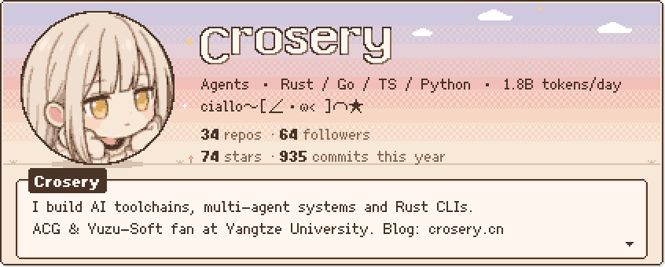
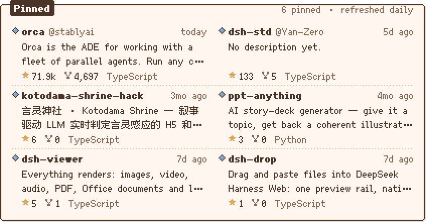
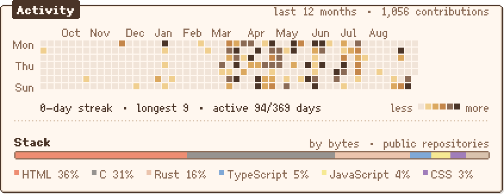

<!--
  Crosery · individual developer · AI toolchains & open source
  Every card below is drawn by scripts/gen-profile.py from live GitHub data:
  pixel type is Fusion Pixel Font (OFL 1.1), the portrait is compiled into
  a 96 px sprite, and the whole page sits on a 2 CSS px art grid.
  Refreshed daily 03:17 +08 via .github/workflows/refresh-cards.yml
-->

<picture>
  <source media="(prefers-color-scheme: dark)" srcset="https://raw.githubusercontent.com/Crosery/Crosery/output/github-contribution-grid-snake-dark.svg" />
  <source media="(prefers-color-scheme: light)" srcset="https://raw.githubusercontent.com/Crosery/Crosery/output/github-contribution-grid-snake.svg" />
  
</picture>

