<!-- ─────────────────────────────────────────────────────────────────── -->
<!--  THE CROSERY DISPATCH · VOL. 02 · ISSUE Nº 18 · MMXXVI            -->
<!--  Design / Code / Writing — all by Crosery                          -->
<!-- ─────────────────────────────────────────────────────────────────── -->

<a href="https://www.crosery.cn/">
  
</a>

<p align="left">
  <a href="https://www.crosery.cn/">
    
  </a>
</p>

---



> 主战场两条同时跑。一条是腾讯开悟 1v1 王者荣耀的 PPO 训练，重在 reward shaping 和双英雄不对称修复；另一条是 **runai**，一个用 Rust 写的 AI CLI，跨 Claude / Codex / Gemini / OpenCode 统一管 skills 和 MCP servers。中间穿插 **ppt-anything** 这种创意系统、**niri-window-switcher** 这种 Linux 桌面玩具、**deepseek-v4** 这种杂志风 landing page。


#### 还在维护的几条线

<table>
  <tr>
    <td width="34%" valign="top">
      <b>NIRI-WINDOW-SWITCHER</b><br/>
      <sub><code>RUST · WAYLAND · TUI</code></sub><br/><br/>
      Niri 合成器的现代窗口切换器，fuzzy 搜索 + 键盘导航 + glassmorphism UI。<br/>
      <sub><a href="https://github.com/Crosery/niri-window-switcher">→ repo</a></sub>
    </td>
    <td width="33%" valign="top">
      <b>ARK_RL</b><br/>
      <sub><code>RL · PYTORCH · INFERENCE</code></sub><br/><br/>
      明日方舟强化学习环境和训练 / 推理。被王者荣耀挤掉时间但活着。<br/>
      <sub><a href="https://github.com/Crosery/Ark_RL">→ repo</a></sub>
    </td>
    <td width="33%" valign="top">
      <b>SIGNAL-KEEPER</b><br/>
      <sub><code>PYTHON · ORCHESTRATION</code></sub><br/><br/>
      长任务观察 + 调度编排工具包，给 OpenClaw 用，跑训练 / 跑评测都能套。<br/>
      <sub><a href="https://github.com/Crosery/signal-keeper">→ repo</a></sub>
    </td>
  </tr>
  <tr>
    <td valign="top">
      <b>BLUE-ARCHIVE-AGENT-SYSTEM</b><br/>
      <sub><code>DOCS · ARCHITECTURE</code></sub><br/><br/>
      碧蓝档案世界观下的多层 Agent 系统架构展示。技术分享 + 二次元壳。<br/>
      <sub><a href="https://github.com/Crosery/blue-archive-agent-system">→ repo</a></sub>
    </td>
    <td valign="top">
      <b>FIGMA-MCP-GUIDE</b><br/>
      <sub><code>MCP · TUTORIAL</code></sub><br/><br/>
      Figma MCP Server 的 17 个 Tools + 7 个 Skills 完全使用指南。<br/>
      <sub><a href="https://github.com/Crosery/figma-mcp-guide">→ repo</a></sub>
    </td>
    <td valign="top">
      <b>PPT 系列</b><br/>
      <sub><code>HTML · MAGAZINE · CHIBI</code></sub><br/><br/>
      router-dispatch · claudecode-partner · jkb-fxh — 杂志风 / 水彩风 / chibi 风的技术分享 PPT。<br/>
      <sub><a href="https://github.com/Crosery?tab=repositories&type=source&language=html">→ all</a></sub>
    </td>
  </tr>
</table>


<!-- ── SECTION 04 / METRICS ──────────────────────────────────────── -->

<p align="left">
  <code>—— SECTION 04 / METRICS ──────────────────────────────────────────────────</code>
</p>

<h2>NUMBERS.</h2>

<div align="center">
  
  
</div>

<div align="center">
  
  
</div>

<br/>


<br/><br/>

<h4>CONTRIBUTION SNAKE — animated, regenerated every 12 hours via GitHub Actions</h4>

<picture>
  <source media="(prefers-color-scheme: dark)" srcset="https://raw.githubusercontent.com/Crosery/Crosery/output/github-contribution-grid-snake-dark.svg" />
  <source media="(prefers-color-scheme: light)" srcset="https://raw.githubusercontent.com/Crosery/Crosery/output/github-contribution-grid-snake.svg" />
  
</picture>


<!-- ── SECTION 05 / CHANNELS ─────────────────────────────────────── -->

<p align="left">
  <code>—— SECTION 05 / CHANNELS ─────────────────────────────────────────────────</code>
</p>

<h2>FIND ME.</h2>

```
WEB         https://www.crosery.cn
GITHUB      https://github.com/Crosery
EMAIL       luoxi2024@foxmail.com
TWITTER     https://twitter.com/XiLuo4125248565
YOUTUBE     https://youtube.com/@XiLuo-l4j
KAGGLE      https://kaggle.com/crosery
```

#### 想合作 / 想 chat 的话

- 工具链 / Claude Code / MCP / runai 相关 — 直接开 issue 或来 X 私信
- 强化学习 / 王者荣耀 RL / Ark_RL — 邮件来聊，附你的项目和卡数
- 创意视觉 / PPT / landing — 看一眼 deepseek-v4、router-dispatch-ppt 这些 repo 的风格再来
- 其他 — 博客 crosery.cn 留言

<br/>


