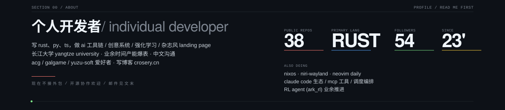
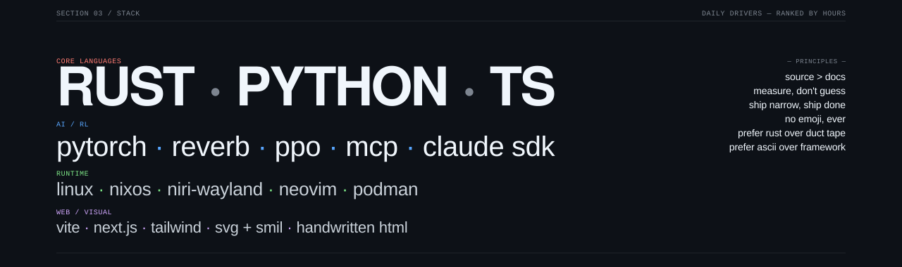

<!-- ─────────────────────────────────────────────────────────────────── -->
<!--  THE CROSERY DISPATCH · VOL. 02 · ISSUE Nº 19 · NIGHT EDITION     -->
<!--  Design / Code / Writing — all by Crosery                          -->
<!--  Optimized for GitHub Dark Mode                                    -->
<!-- ─────────────────────────────────────────────────────────────────── -->

<a href="https://www.crosery.cn/">
  
</a>

<p align="left">
  <a href="https://www.crosery.cn/">
    
  </a>
</p>

---






> 三条同时跑。**runai** 是 rust 写的 ai cli 资源管理器，跨 Claude / Codex / Gemini / OpenCode 统一管 skills 和 MCP servers，最近迭代 `recommend feedback` 和 market install。**acp-bus** 是多 ai agent 协作总线，topic 订阅 + 消息路由把多个 ai 客户端串成 pipeline。**ppt-anything** 是 ai story-deck 生成器，给一个 topic 出连贯插画 PPT，水彩 / chibi / 印刷风都能切。




#### 还有这些线在维护

<table>
  <tr>
    <td width="34%" valign="top">
      <b>FIGMA-MCP-GUIDE</b><br/>
      <sub><code>MCP · TUTORIAL · DOCS</code></sub><br/><br/>
      Figma MCP Server 17 个 Tools + 7 个 Skills 完全使用指南。<br/>
      <sub><a href="https://github.com/Crosery/figma-mcp-guide">→ repo</a></sub>
    </td>
    <td width="33%" valign="top">
      <b>BLUE-ARCHIVE-AGENT-SYSTEM</b><br/>
      <sub><code>DOCS · ARCHITECTURE</code></sub><br/><br/>
      碧蓝档案世界观的多层 Agent 系统架构展示，技术分享 + 二次元壳。<br/>
      <sub><a href="https://github.com/Crosery/blue-archive-agent-system">→ repo</a></sub>
    </td>
    <td width="33%" valign="top">
      <b>HEXO-FREE-AI-SUMMARY</b><br/>
      <sub><code>HEXO · PLUGIN · FREE</code></sub><br/><br/>
      Hexo 博客的免费 AI 文章摘要插件，给 crosery.cn 自用。<br/>
      <sub><a href="https://github.com/Crosery/hexo-free-ai-summary">→ repo</a></sub>
    </td>
  </tr>
  <tr>
    <td valign="top">
      <b>HOMEBREW-TOKENICODE</b><br/>
      <sub><code>BREW TAP · DESKTOP CLIENT</code></sub><br/><br/>
      TOKENICODE 桌面客户端的 Homebrew tap。<br/>
      <sub><a href="https://github.com/Crosery/homebrew-tokenicode">→ tap</a></sub>
    </td>
    <td valign="top">
      <b>CROSERY-NEOVIM-CONFIG</b><br/>
      <sub><code>NEOVIM · LUA · DOTFILES</code></sub><br/><br/>
      日常用的 neovim 配置，rust + python LSP + niri-aware key map。<br/>
      <sub><a href="https://github.com/Crosery/Crosery-neovim-config">→ repo</a></sub>
    </td>
    <td valign="top">
      <b>NIXOS-CONFIG</b><br/>
      <sub><code>NIXOS · FLAKES · DESKTOP</code></sub><br/><br/>
      个人 NixOS 配置，niri-wayland 桌面 + 全套开发环境。<br/>
      <sub><a href="https://github.com/Crosery/nixos-config">→ repo</a></sub>
    </td>
  </tr>
</table>







<!-- ── SECTION 05 / METRICS ────────────────────────────────────── -->

<p align="left">
  <code>—— SECTION 05 / METRICS ──────────────────────────────────────────────────</code>
</p>

<h2>NUMBERS<span style="color:#ff7b72">.</span></h2>

<div align="center">


</div>

<div align="center">


</div>

<br/>


<br/><br/>

<h4>CONTRIBUTION SNAKE — animated, regenerated every 12 hours via GitHub Actions</h4>

<picture>
  <source media="(prefers-color-scheme: dark)" srcset="https://raw.githubusercontent.com/Crosery/Crosery/output/github-contribution-grid-snake-dark.svg" />
  <source media="(prefers-color-scheme: light)" srcset="https://raw.githubusercontent.com/Crosery/Crosery/output/github-contribution-grid-snake.svg" />
  
</picture>


<!-- ── SECTION 06 / CHANNELS ───────────────────────────────────── -->

<p align="left">
  <code>—— SECTION 06 / CHANNELS ─────────────────────────────────────────────────</code>
</p>

<h2>FIND ME<span style="color:#ff7b72">.</span></h2>

```
WEB         https://www.crosery.cn
GITHUB      https://github.com/Crosery
EMAIL       luoxi2024@foxmail.com
TWITTER     https://twitter.com/XiLuo4125248565
YOUTUBE     https://youtube.com/@XiLuo-l4j
KAGGLE      https://kaggle.com/crosery
```

#### 想合作 / 想 chat 的话

- **工具链 / Claude Code / MCP / runai** — 直接开 issue 或来 X 私信
- **多 agent 协作 / acp-bus / 调度编排** — 邮件来聊，附你的场景和并发量
- **创意视觉 / PPT / landing** — 看一眼 deepseek-v4、router-dispatch-ppt 这些 repo 的风格再来
- **NixOS / niri-wayland / linux 桌面** — 直接 dotfiles fork，issue 提
- **其他** — 博客 crosery.cn 留言

<br/>


